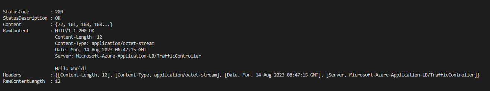

# AGFC
AGFC-BYO

##### 
1. Tested from windows Machine
2. Rewrite the syntax to cover running from windows powershell 
3. AGFC, Subnet and subnet delegation was done using azure portal 
####

## How to use 

####
1. Clone this repo
2. Create vNet and Subnet for AKS and AGFC
3. Add subnet deligation on AGFC subnet ;Microsoft.Servic.Network/trafficController
4. Create AKS using Azure Portal 
5. Get the AKS kubeconfig 
6. Create AGFC using Azure Portal
7. Take note information needed on deployment.ps1 
8. Follow the command through
####

##
Sample Output 

##
##
Reference 

1. https://learn.microsoft.com/en-us/azure/application-gateway/for-containers/quickstart-create-application-gateway-for-containers-byo-deployment?tabs=existing-vnet-subnet
1. https://learn.microsoft.com/en-us/azure/application-gateway/for-containers/how-to-backend-mtls-gateway-api?tabs=byo

